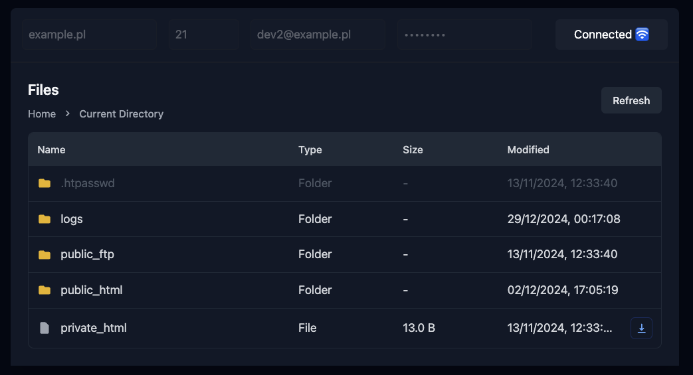

# FTP Client

A modern FTP client with Go backend and Svelte frontend.



## Features

- 🚀 Modern UI with dark mode
- 📂 Intuitive file browsing
- 🕒 Recent connections (last 5)
- 💫 Smooth animations

## Setup

### Backend

1. Clone the repository
2. Navigate to the `backend` directory

```bash
cd backend
```

4. Install dependencies

```bash
go mod download
```

### Frontend

1. Navigate to the `frontend` directory

```bash
cd frontend
```

3. Install dependencies

```bash
npm install
```

### Development

1. Start the backend:
   ```bash
   go run cmd/app/main.go
   ```
2. Start the frontend development server:
   ```bash
   cd frontend
   npm run dev
   ```
